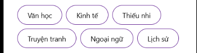
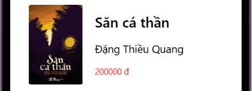
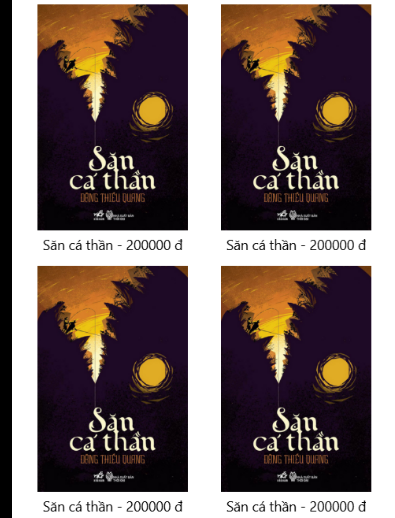
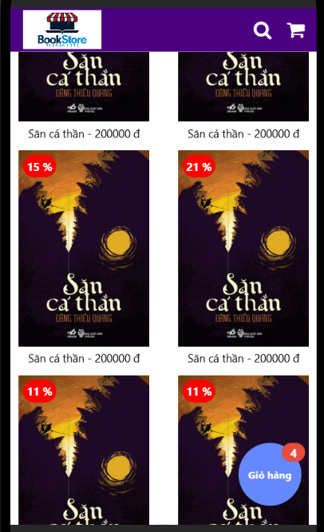
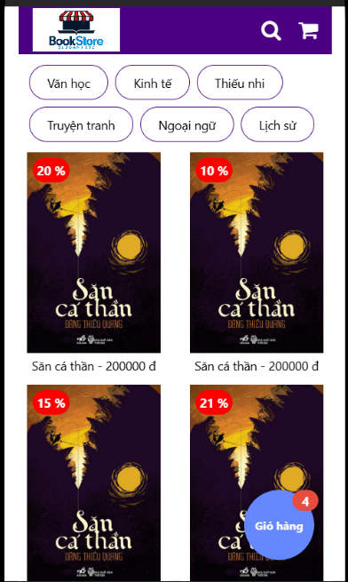
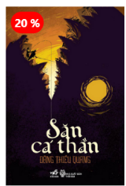

## 📱 Minh chứng

<table>
  <tr>
    <td align="center">
      <strong>1. Header</strong>
    </td>
    <td align="center">
      <strong>2. Category Chips</strong>
    </td>
  </tr>
  <tr>
    <td align="center">
      
    </td>
    <td align="center">
      
    </td>
  </tr>
</table>
<table>
  <tr>
    <td align="center">
      <strong>3. Book Card</strong>
    </td>
    <td align="center">
      <strong>4. Book Grid</strong>
    </td>
  </tr>
  <tr>
    <td align="center">
      
    </td>
    <td align="center">
      
    </td>
  </tr>
</table>

 

<table>
  <tr>
    <td align="center">
      <strong>5. ScrollView</strong>
    </td>
    <td align="center">
      <strong>6. Floating Cart Button</strong>
    </td>
  </tr>
  <tr>
    <td align="center">
      
    </td>
    <td align="center">
      
    </td>
  </tr>
</table>

 

### 7. Cart Badge

  

